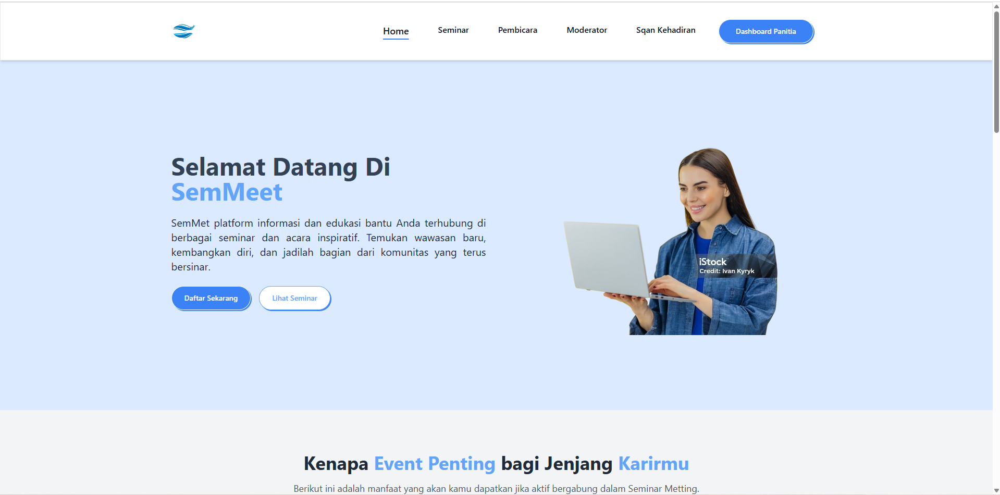
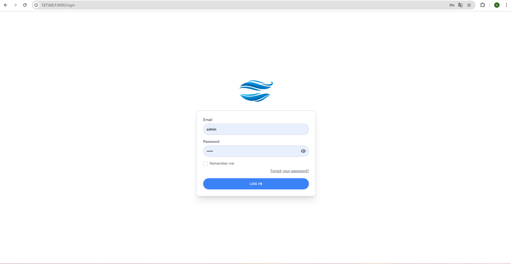
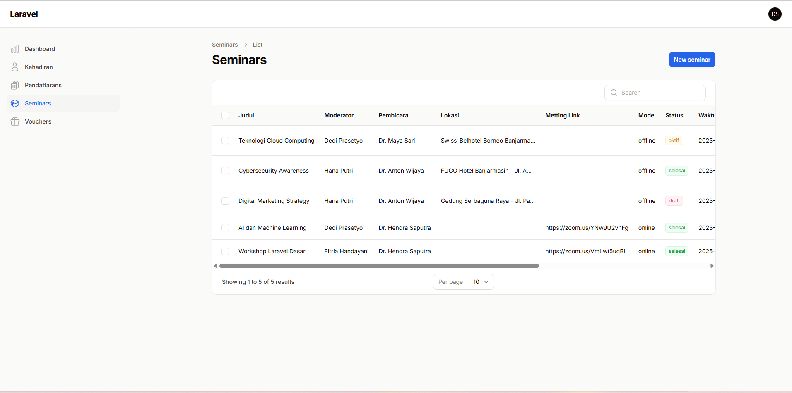
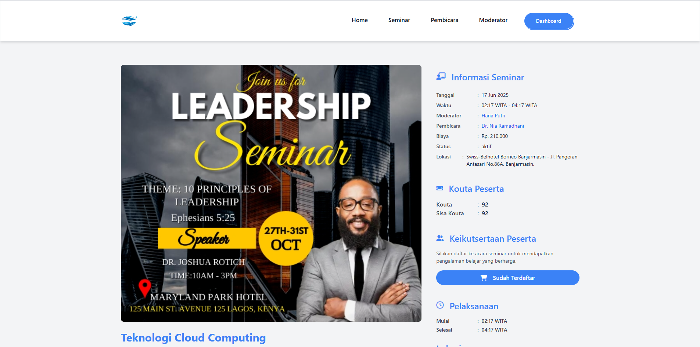
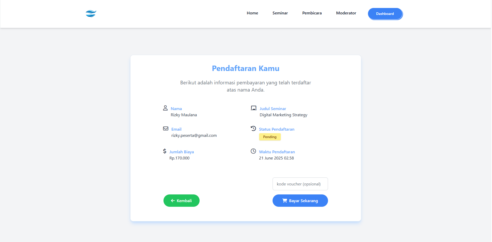
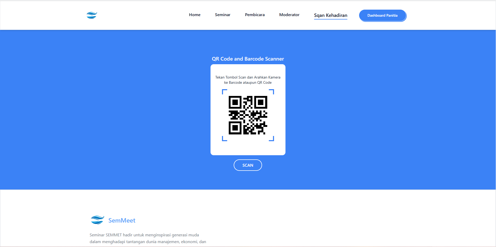
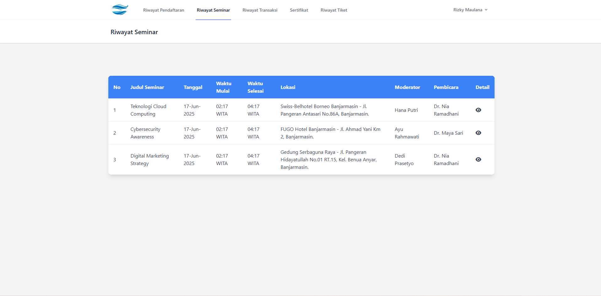
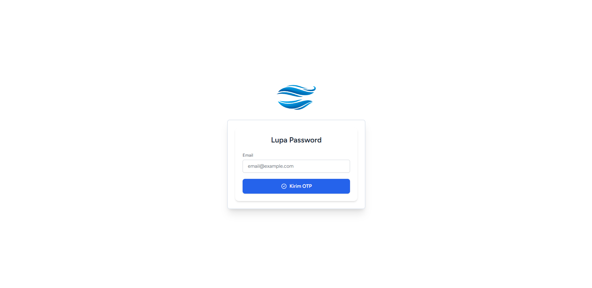

<p align="center">
  <a href="https://laravel.com" target="_blank">
    
  </a>
</p>

<p align="center">
  <a href="https://github.com/laravel/framework/actions"></a>
  <a href="https://packagist.org/packages/laravel/framework"></a>
 <a href="https://packagist.org/packages/laravel/framework"></a>
  <a href="https://packagist.org/packages/laravel/framework"></a>
</p>


# Sistem Manajemen Seminar

Aplikasi ini merupakan sistem **manajemen seminar** berbasis web yang dibangun dengan **Laravel** dan **Filament Admin** Sistem ini memudahkan pendaftaran online serta pengelolaan data seminar mulai dari pendaftaran peserta, pengelolaan jadwal, hingga pencatatan narasumber.

---

## Fitur Utama

- **Manajemen Peserta Seminar** (pendaftaran, daftar hadir, dan status keikutsertaan)
- **Pendaftaran Payment Gatway** (Pembayaran terintegrasi dana, bank dll)
- **Manajemen Jadwal Seminar** (tanggal, tempat, dan sesi seminar)
- **Manajemen Narasumber / Pemateri**
- **Generate Sertifikat** 
- **Dokumentasi & Arsip Seminar**
- **Dashboard interaktif** menggunakan **Filament Admin**

---

## Tampilan Aplikasi

<table align="center">
  <tr>
    <td align="center" width="50%">
      <strong>Home</strong><br><br>
      
    </td>
    <td align="center" width="50%">
      <strong>Login</strong><br><br>
      
    </td>
  </tr>
  <tr>
    <td align="center" width="50%">
      <strong>Dashboard Panitia</strong><br><br>
      
    </td>
    <td align="center" width="50%">
      <strong>Detail Seminar</strong><br><br>
      
    </td>
  </tr>
  <tr>
    <td align="center" width="50%">
      <strong>Pendaftaran</strong><br><br>
      
    </td>
    <td align="center" width="50%">
      <strong>Sqan Absen Kehadiran</strong><br><br>
      
    </td>
  </tr>
  <tr>
    <td align="center" width="50%">
      <strong>Dashboard Peserta</strong><br><br>
      
    </td>
    <td align="center" width="50%">
      <strong>Forgot Password</strong><br><br>
      
    </td>
  </tr>
</table>


---


## Teknologi yang Digunakan

**Backend**      PHP 8.2           
**Frontend**     TailwindCss 3           
**Framework**    Laravel 11        
**Admin Panel**  Filament 3.3      
**Frontend**     ailwind CSS 3    
**Database**     MySQL / MariaDB   

---

##  Instalasi & Setup

1. Clone repository
    ```bash
    git clone https://github.com/username/nama-repo.git
    cd nama-repo
    ```
